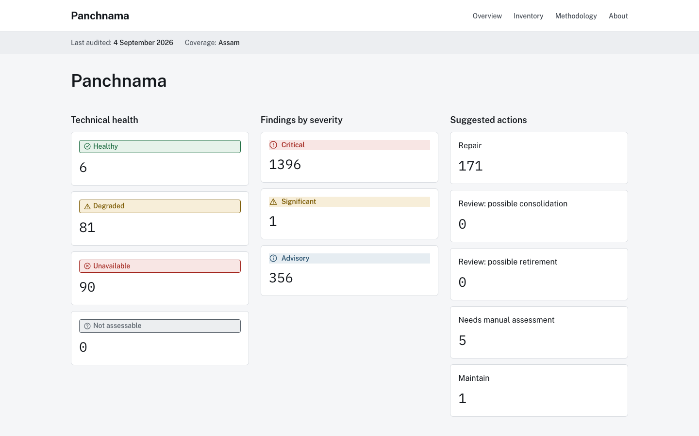

# Panchnama

**An independent, evidence-backed audit of Assam's government websites: which ones need attention, why, and what should happen next.**

[Live audit →](https://panchnama.vercel.app/)



<sub>An independent case-study prototype, not affiliated with or endorsed by the Government of Assam.</sub>

## The problem

Government websites are built one department, board, scheme and vendor at a time, over years, and nobody owns the collection as a whole. No one can produce a dated, checkable answer to basic questions: which official portals are actually reachable today, which links send citizens to broken pages, which sites have quietly gone stale, and which ones duplicate each other.

Without that answer, "improve the web estate" collapses into two weak moves: do nothing, because no one can point to a defensible list of what's broken, or launch a big redesign based on impressions rather than evidence.

## What it does

- **Builds an inventory** of government portals from named official sources, recording where and when each one was found.
- **Checks each portal** for reachability, HTTPS and certificate problems, broken links, signs of stale content, directory mismatches and possible overlap with other portals.
- **Backs every finding with evidence:** the URL, what was observed, when, and the rule that flagged it.
- **Suggests an action per portal:** repair, review for consolidation, review for retirement, maintain, or needs manual assessment.
- **Publishes the dataset and method** so anyone can check the work.
- **Accepts anonymous citizen reports** about listed portals. These are moderated and shown separately from the technical findings.

## Key product decisions

- **No single health score.** Combining unrelated checks into one number would look precise without being meaningful. Each finding stands on its own.
- **Uncertainty is a real answer.** "Not assessable" and "review required" are published outcomes. A site that blocks automated checks is reported as exactly that, not marked broken or quietly skipped.
- **Automation collects evidence; people make the calls.** The system can flag that two portals look redundant, but deciding to retire a government service stays a human decision.
- **Citizen reports never change a verdict.** They add context next to the technical audit, not inside it.
- **Legal risk was assessed before the first live crawl.** The crawler respects robots.txt, never logs in or submits forms, and the decision to crawl live government sites was written up and signed off first.

## Results & evidence

The audit dated **4 September 2026** covered **177 portals**:

| Technical health | Portals |
|---|---|
| Healthy | 6 |
| Degraded | 81 |
| Unavailable | 90 |

- **1,396 critical findings**, each with dated evidence.
- **171 portals** were given "repair" as the suggested action, and 5 need manual assessment.

## Scope & limits

- **A dated snapshot, not live monitoring.** Each run carries its own audit date and method version.
- **The observed estate, not a complete inventory.** It covers what was discoverable through named official sources, not every system the government runs.
- **Findings are observations,** not legal, security, accessibility or policy determinations.
- **Assam only, English only.** The citizen report form is not yet in Assamese.

## Next in roadmap

- Repeat the method for a second state, to test whether it transfers.
- Rerun on a schedule and show change over time across dated snapshots.
- Add ownership and fix-tracking, so departments can respond to findings.

<details>
<summary><strong>Tech stack & running locally</strong></summary>

**Stack:** pnpm monorepo. Next.js (App Router) public scorecard, a TypeScript audit CLI (inventory, crawl, analyse, publish) with a Playwright fallback for script-heavy sites, Drizzle and Postgres, Zod schemas, Vitest, GitHub Actions CI.

```text
apps/web/                # Next.js public scorecard
packages/audit-cli/      # inventory, crawl, analyze, publish commands
packages/audit-core/     # pure audit rules and classifiers
packages/database/       # Drizzle schema, migrations, DB access
packages/schema/         # shared Zod schemas and TypeScript types
config/                  # source registry and crawl/check policy
data/                    # seed, raw, evidence, review, published, fixtures
docs/                    # methodology, decision records, session log
```

Requires Node.js 22+ and pnpm 9+.

```bash
pnpm install
pnpm lint && pnpm typecheck && pnpm test && pnpm build
```

The crawler's browser-fallback tests need Chromium: `pnpm --filter @panchnama/audit-cli exec playwright install chromium`.

**Deploying:** import into Vercel with Root Directory `apps/web`. The scorecard is built statically from published data and needs no environment variables. Citizen reports (`/api/experiences`) need `DATABASE_URL`; without it those endpoints return 503 and the rest of the site works.

The full product definition, audit rules and crawl policy are in [implementation.md](implementation.md). Working with an AI coding agent: see [AGENTS.md](AGENTS.md).

</details>
